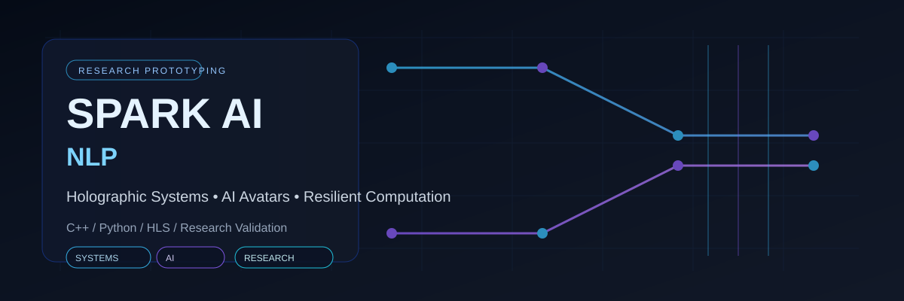

  

<h1 align="center">Spark AI NLP</h1>

  Building holographic and quantum-inspired simulation prototypes for resilient display, AI avatar, and error-correction research.

  
  
  
  

## Overview

Spark AI NLP develops software and hardware-oriented prototypes for exploring resilient computational systems. Current public work spans deterministic residual analysis, decoder-oriented C++ experimentation, simulation tooling, and hardware-accelerated implementation paths.

The repositories are positioned as research and prototyping artifacts. They make assumptions, methods, source code, and validation boundaries inspectable rather than presenting unverified claims as finished products.

## Core research areas

| Area | Focus |
|---|---|
| Holographic simulation | Structured simulation concepts for resilient visual and computational systems |
| AI-avatar research | Prototype exploration for intelligent, display-oriented interaction systems |
| Error-correction research | Residual analysis, decoder design, and parity-oriented computational workflows |
| Performance engineering | C++, CMake, OpenMP, benchmarking, and reproducible tooling |
| Hardware/software prototyping | HLS implementation paths and AMD/Xilinx-oriented integration experiments |

## Portfolio

| Repository | Description |
|---|---|
| [qldpc_decoder_cpp](https://github.com/sparkainlp-x/qldpc_decoder_cpp) | C++ decoder experimentation with benchmarking, OpenMP acceleration, and HLS-oriented implementation work |
| [oes32-hls](https://github.com/sparkainlp-x/oes32-hls) | C++ HLS prototype for deterministic OES-32 telemetry checks and hardware/software co-design exploration |
| [quantum-error-correction-demo](https://github.com/sparkainlp-x/quantum-error-correction-demo) | Python simulation workflow for OES-32-style residual and error-correction concepts |
| [oes32-residual](https://github.com/sparkainlp-x/oes32-residual) | Deterministic Python reference for a documented 32-component residual contract and numerical validation |

## Methodology

- Scope and limitations are stated explicitly
- Simulation output is separated from externally validated results
- Experiments remain reproducible and inspectable
- Validation is handled through test harnesses and documented checks
- Hardware targets and performance metrics are treated as evidence-based only where contextualized

## Collaboration

I welcome conversations with research groups, technical collaborators, and partners interested in resilient computation, decoder engineering, AI-avatar prototyping, and hardware/software co-design.

For collaboration, open an issue in the relevant repository or contact through the maintained project channels.
